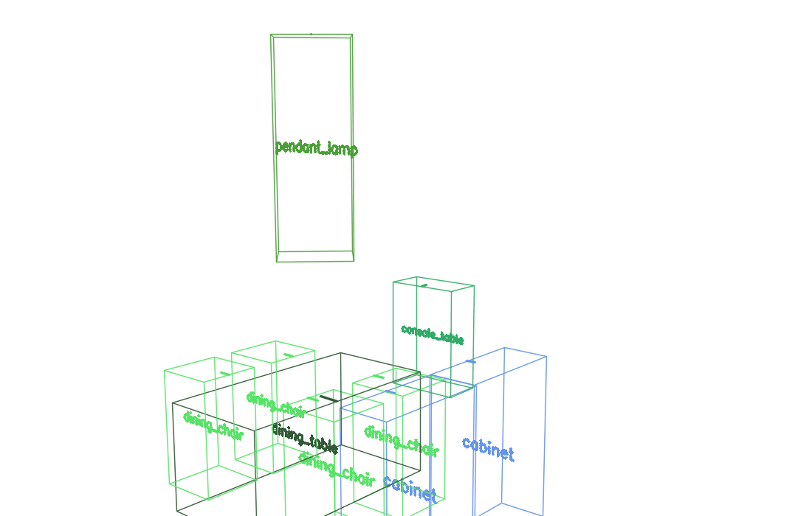
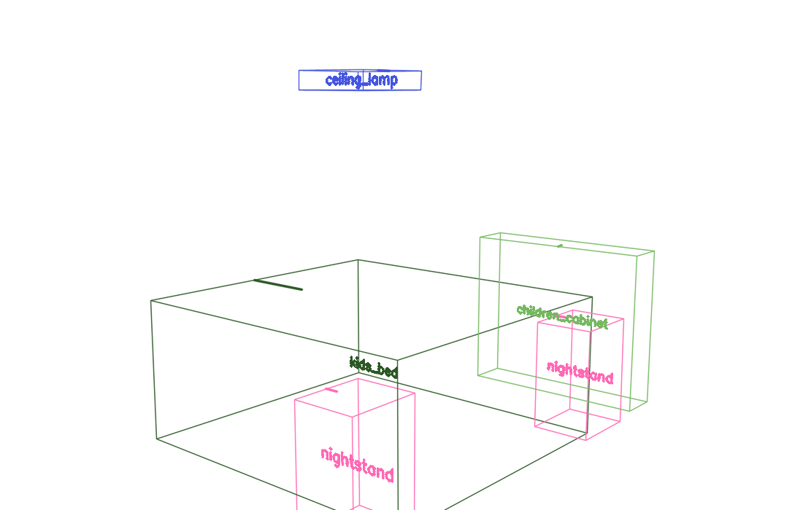
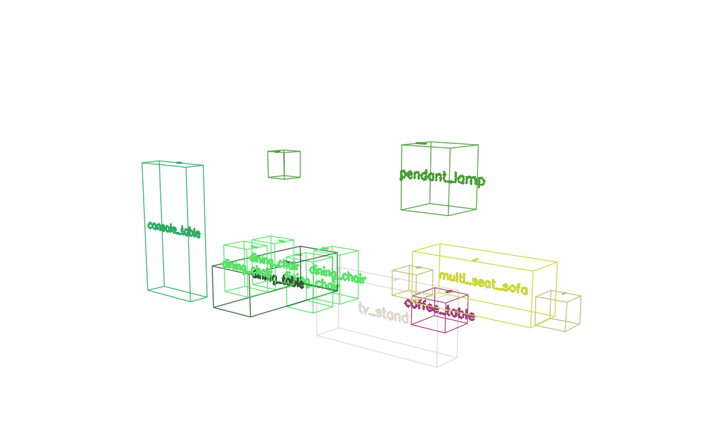

# viz3dl


<p align="center">
    
    
    
</p>

viz3dl is a tiny toolkit for rendering 3D layout into clean 2D previews or GIF turntables.

## Installation

```bash
pip install git+https://github.com/caizhuojiang/viz3dl.git
```

## Quickstart

```python
from viz3dl import SceneObject, SceneLayout, LayoutVisualizer

# Describe your scene using half extents (width/height/depth) and yaw in radians
table = SceneObject(
    name="table",
    location=(0.0, 0.4, 0.0),
    dimensions=(0.6, 0.4, 0.4),
    yaw=1.57,
)
chair = SceneObject(
    name="chair",
    location=(0.8, 0.35, 0.0),
    dimensions=(0.35, 0.35, 0.35),
    yaw=-1.57,
)

layout = SceneLayout([table, chair])
layout.normalize_to_origin(align_floor=True)
layout.scale_to_unit_cube()

viz = LayoutVisualizer(layout)
frame = viz.render_view(radius=10, elevation=-20, azimuth=0)

from PIL import Image
Image.fromarray(frame).save("scene.png")
```

Generate a simple turntable GIF:

```python
viz.render_rotation(
    output_path="scene.gif",
    radius=10.0,
    elevation=-15,
    start_azimuth=-45,
    end_azimuth=45,
    step=3,
    frame_duration_ms=80,
)
```

## Conventions

- Coordinates follow an **X-right, Y-up, Z-forward** convention.
- `dimensions` are half extents in meters (i.e., width/height/depth from center to box face). Divide by two if you store full sizes.
- `yaw` values are in **radians** and rotate around the Y axis.
- Label rendering uses OpenCV fonts; for non-Latin text, adjust `TextRasterizer` to use your glyph rasterizer of choice.

## License

This project is distributed under the MIT License.
